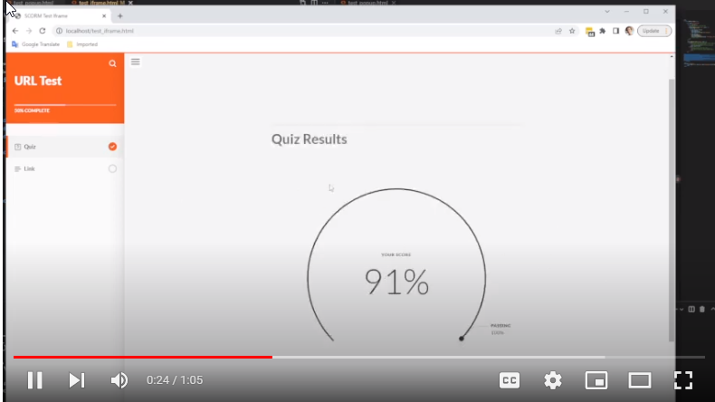

# react_scrom


connect a react app to a scorm training course that is exported from articulate rise an webOnly-noLMS

setup
```
docker-compose build
docker-compose up
```

site should be available on `http://localhost`


See video for instructions how the setup works:

[](https://www.youtube.com/watch?v=bvsTYZoTr54)


